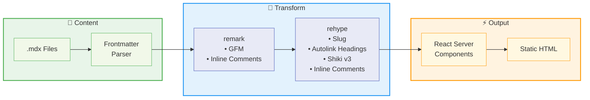

<h1 align="center">🔄 Verto</h1>

<p align="center">
  <strong>Write. Transform. Publish.</strong><br>
  Latin <em>vertō</em> — to transform
</p>

<p align="center">
  
  
  
  
  
</p>

---

## 🎯 What is Verto?

**Verto** is a docs-and-blog hybrid built on Next.js 15. You write MDX. Verto transforms it into a polished, fully static site with Mintlify-style sidebar navigation, magazine-layout blog posts, and a custom inline comments system that turns footnotes into floating popovers.

One codebase, two content types. Docs get collapsible sidebar sections. Blog posts get date sorting and tag filtering. Everything is pre-rendered at build time, ships zero client-side JS for syntax highlighting, and deploys to Vercel with a single command.

## ✨ Features

- 📚 **Docs + blog hybrid** — sidebar navigation for docs, magazine layout for blog, one codebase
- 💬 **Inline comments** — `[^c-N]` footnotes become highlighted text with click-to-reveal popovers
- 🧩 **10+ block components** — Callout, Toggle, BookmarkCard, Figure, TaskList, Table, and more
- 🎨 **Shiki syntax highlighting** — dual light/dark themes, rendered at build time, zero client JS
- 🌓 **Dark mode** — CSS variables, no-flash script, persists preference
- ✍️ **MDX authoring** — Markdown with JSX components, compiled server-side
- ⚡ **Fully static** — every page pre-rendered at build time, ready for Vercel

---

## 🏗️ Architecture

Content goes in, static HTML comes out. Here's the pipeline:



---

## 🛠️ Tech Stack

| | Layer | Technology | Version | Purpose |
|---|-------|-----------|---------|---------|
| ⚛️ | Framework | Next.js | 15 | App Router, static generation |
| ⚛️ | UI | React | 19 | Server Components |
| 📝 | Language | TypeScript | 5 | Type safety |
| 🎨 | Styling | Tailwind CSS | 4 | CSS-first config, design tokens |
| ✍️ | Content | MDX via next-mdx-remote | 5 | Markdown + JSX components |
| 🎨 | Syntax | Shiki | 3 | Dual-theme code highlighting |
| 🔗 | Plugins | remark-gfm, rehype-slug, rehype-autolink-headings | — | Markdown extensions |
| 🛠️ | Custom Plugins | remark/rehype-inline-comments | — | Inline comment system |

---

## 🚀 Quick Start

### Prerequisites

- 📦 **Node.js** 18.17 or higher

### Run Locally

```bash
# Clone the repository
git clone https://github.com/tsaiggo/verto.git
cd verto

# Install dependencies
npm install

# Start the dev server
npm run dev
```

Site runs at **http://localhost:3000**.

### Available Commands

| Command | Description |
|---------|-------------|
| `npm run dev` | Dev server with hot reload |
| `npm run build` | Static production build |
| `npm start` | Serve the production build |
| `npm run lint` | ESLint |

### Production Build

```bash
npm run build
npm start
```

### Deployment

```bash
npx vercel
```

Static generation by default. No config needed.

---

## 📁 Project Structure

```
verto/
├── app/            → Pages and layouts (App Router)
├── components/     → Layout (Navbar, Sidebar, ToC) + MDX blocks + UI
├── content/        → MDX files for docs and blog + navigation.json
└── lib/            → MDX pipeline, Shiki config, remark/rehype plugins, types
```

---

## 📝 Content Guide

### Docs

Create `content/docs/{group}/{slug}.mdx`:

```mdx
---
title: Page Title
description: For SEO.
order: 1
---

Your content here.
```

Register the page in `content/navigation.json`. Each group becomes a collapsible sidebar section.

### Blog

Create `content/blog/{slug}.mdx`:

```mdx
---
title: Post Title
description: Summary.
date: "2026-03-06"
author: Name
tags: ["tag"]
---

Your content here.
```

Filename = URL slug. Posts sort by date descending.

---

## 🧩 Block Components

| Component | Description |
|-----------|-------------|
| `Callout` | Admonitions: `info`, `warning`, `tip` |
| `Toggle` | Collapsible content block |
| `BookmarkCard` | Link preview card with title + description |
| `Figure` | Image with caption |
| `DiagramPlaceholder` | Placeholder for diagrams |
| `TaskList` | Checkbox task lists |
| `Table` | Styled Markdown tables |
| `BlockquoteStyled` | Styled blockquotes |
| `CodeBlock` | Shiki-highlighted code with dual themes |
| `InlineCode` | Styled inline `code` spans |

---

## 💬 Inline Comments

The signature feature. Uses Markdown footnote syntax with a `c-` prefix:

```mdx
This took real effort[^c-1] to get right.

[^c-1]: Three days of SSR debugging. Worth it.
```

- `[^c-N]` → highlighted text + popover in Verto
- `[^N]` → regular footnote (still works)
- Degrades to standard footnotes on GitHub, no content lost either way

A custom remark plugin walks the AST, finds the `c-` prefixed footnotes, and transforms them into special nodes. A matching rehype plugin converts those into custom HTML elements. The MDX component map renders them as highlighted text with popover UI.

---

## 🖼️ Screenshots

<!-- TODO: Add screenshots -->

---

## 💡 Why This Exists

<!-- Write your story here — why you built Verto, what problem it solves. Make it personal. -->

---

## 📄 License

This project is licensed under the Apache License 2.0. See the [LICENSE](LICENSE) file for details.

---

<p align="center">
  Made with ❤️ by <a href="https://github.com/tsaiggo">tsaiggo</a>
</p>
