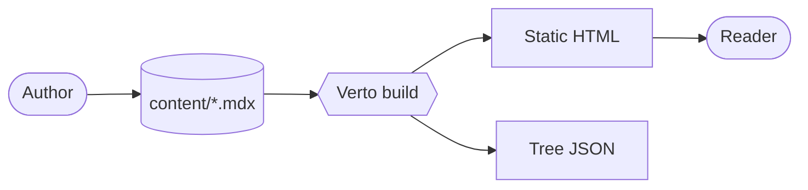
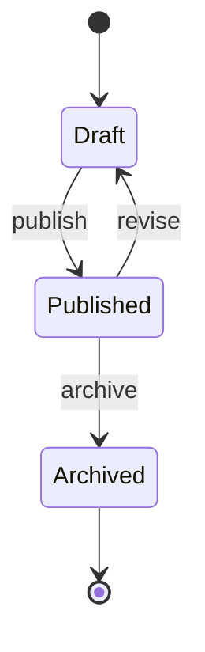

# The Verto Kitchen Sink

This post is a living regression test[^c-1]. Every component in `mdx-components.tsx`, every remark/rehype plugin, and every Shiki notation appears below at least once. If anything breaks in the renderer, you'll see it here first.

> The best way to document a system is to use it for something real.

If you are reading this on the published site, every block below is the live output — no screenshots, no fixtures.

---

## 1. Prose, GFM, and the Basics

Verto ships with `remark-gfm`, so you get tables, task lists, strikethrough, and autolinks for free.

You can mix **bold**, *italic*, ~~strikethrough~~, and `inline code` like `npm run dev` mid-sentence. Bare URLs autolink: https://github.com/tsaiggo/verto.

> "A blog engine is a typography system that occasionally renders code."
>
> Every blockquote you write picks up the `BlockquoteStyled` upgrade automatically — no JSX required.

### Task list (GFM checkboxes)

- [x] Open `.mdx` file
- [x] Write Markdown
- [x] Drop in JSX components
- [ ] Discover a renderer bug
- [ ] File an issue

### Table (auto-styled `<Table>`)

| Feature              | Source                 | Bundle cost  |
|----------------------|------------------------|--------------|
| Shiki highlighting   | build-time rehype      | 0 KB         |
| KaTeX math           | build-time rehype      | CSS only     |
| Mermaid diagrams     | dynamic `import()`     | lazy         |
| Excalidraw diagrams  | dynamic `import()`     | lazy         |
| Inline comments      | custom remark + rehype | tiny island  |

---

## 2. Callouts

Three flavours — `info` (default), `warning`, `tip`.

<Callout>
  Default callout. No `type` prop needed.
</Callout>

<Callout type="warning">
  Warnings should always end with a recommended alternative — surface a pitfall *and* show the way out.
</Callout>

<Callout type="tip">
  Pair `<Callout type="tip">` with a code sample to reinforce a recommended pattern.
</Callout>

---

## 3. Toggle

Use `<Toggle>` for supporting detail you want available but not in the way.

<Toggle title="How does Verto find this post?">
  `lib/content-source.ts` walks the `content/` directory at build time, reads frontmatter, and builds a navigation tree. Files with a `date` field land in the blog feed; everything else is treated as docs.

  ```ts
  const CONTENT_DIR = path.join(process.cwd(), "content");
  ```
</Toggle>

<Toggle title="Why MDX instead of plain Markdown?">
  MDX lets us mix JSX components into prose without leaving Markdown. The remark/rehype pipeline still handles every standard CommonMark feature; JSX is purely additive.
</Toggle>

---

## 4. Tabs

The `id` prop syncs the active tab with the URL hash, so `…#install=pnpm` deep-links to a specific tab.

<Tabs id="install">
  <Tab label="npm">
    ```bash
    npm install verto
    ```
  </Tab>
  <Tab label="pnpm">
    ```bash
    pnpm add verto
    ```
  </Tab>
  <Tab label="yarn">
    ```bash
    yarn add verto
    ```
  </Tab>
  <Tab label="bun">
    ```bash
    bun add verto
    ```
  </Tab>
</Tabs>

---

## 5. Steps

`<Steps>` numbers heading-led blocks via a pure CSS counter — zero JavaScript.

<Steps>
### Clone the repo

```bash
git clone https://github.com/tsaiggo/verto.git
cd verto
```

### Install dependencies

```bash
npm install
```

### Drop content under `content/`

Any `.md` or `.mdx` file is auto-discovered. No registration step.

### Start the dev server

```bash
npm run dev
```
</Steps>

---

## 6. Cards

`<CardGroup cols={n}>` lays out clickable `<Card>` entries.

<CardGroup cols={2}>
  <Card title="Quick Start" description="Spin up Verto in 60 seconds" href="/read/docs/getting-started/installation" />
  <Card title="Inline Comments" description="Annotate your prose with [^c-1] popups" href="/read/docs/core-concepts/inline-comments" />
  <Card title="Syntax Highlighting" description="Shiki + dual themes + diff/focus/word" href="/read/docs/features/syntax-highlighting" />
  <Card title="Dark Mode" description="CSS-variable based, no flash" href="/read/docs/features/dark-mode" />
</CardGroup>

---

## 7. Accordion

Pass `exclusive` to enforce one-open-at-a-time.

<AccordionGroup exclusive>
  <Accordion title="Why footnote-style inline comments?">
    Because `[^c-id]` is valid CommonMark. GitHub, Typora, and any other Markdown renderer fall back to a regular footnote — your annotations are never lost.
  </Accordion>
  <Accordion title="Does Verto need a database?">
    No. Verto reads from the filesystem at build time. The output is fully static.
  </Accordion>
  <Accordion title="Can I customize navigation order?">
    Yes — drop `content/navigation.json` with `overrides` keyed by slug.
  </Accordion>
</AccordionGroup>

---

## 8. FileTree

<FileTree>
  <Folder name="content" defaultOpen>
    <Folder name="blog" defaultOpen>
      <File name="building-verto.mdx" />
      <File name="the-verto-kitchen-sink.mdx" comment="this post" />
    </Folder>
    <Folder name="docs">
      <File name="getting-started/installation.mdx" />
      <Folder name="features">
        <File name="syntax-highlighting.mdx" />
        <File name="diagrams.mdx" />
        <File name="excalidraw.mdx" />
        <File name="math.mdx" />
      </Folder>
    </Folder>
    <File name="navigation.json" comment="optional overrides" />
  </Folder>
  <Folder name="components/mdx" defaultOpen={false}>
    <File name="Tabs.tsx" />
    <File name="Excalidraw.tsx" />
    <File name="Mermaid.tsx" />
  </Folder>
</FileTree>

---

## 9. Figures and Bookmarks

<Figure
  src="https://placehold.co/800x400/f3f4f6/111827?text=Verto+Pipeline"
  alt="Markdown source flowing through the Verto pipeline into static HTML"
  caption="Fig. 1 — Markdown source enters; static HTML exits."
/>

<BookmarkCard
  url="https://github.com/tsaiggo/verto"
  title="tsaiggo/verto — GitHub"
  description="A modern blog engine — write Markdown, get a publication."
/>

<BookmarkCard
  url="https://nextjs.org"
  title="Next.js"
  description="The React framework Verto is built on."
/>

<DiagramPlaceholder
  title="Future: Comment threads"
  description="Threaded discussions, separate from inline author comments. Sketch coming in v0.3."
/>

---

## 10. Math (KaTeX)

Inline math drops in mid-sentence: Euler's identity is $e^{i\pi} + 1 = 0$, the golden ratio is $\varphi = \frac{1 + \sqrt{5}}{2}$, and the harmonic series diverges as $\sum_{n=1}^{N} \frac{1}{n} \sim \ln N$.

Block math gets its own line:

$$
\int_{-\infty}^{\infty} e^{-x^2} \, dx = \sqrt{\pi}
$$

Aligned multi-line proofs use the standard `aligned` environment:

$$
\begin{aligned}
(a + b)^2 &= a^2 + 2ab + b^2 \\
(a - b)^2 &= a^2 - 2ab + b^2 \\
a^2 - b^2 &= (a + b)(a - b)
\end{aligned}
$$

Matrices, sums, products — all standard:

$$
A = \begin{bmatrix}
1 & 2 & 3 \\
4 & 5 & 6 \\
7 & 8 & 9
\end{bmatrix}
\qquad
\sum_{n=1}^{\infty} \frac{1}{n^2} = \frac{\pi^2}{6}
$$

---

## 11. Mermaid Diagrams

As a fenced block:



As an MDX component (useful when you want to template the chart string):

<Mermaid chart={`
sequenceDiagram
  participant R as Reader
  participant V as Verto
  participant FS as Filesystem
  R->>V: GET /read/blog/the-verto-kitchen-sink
  V->>FS: read .mdx
  FS-->>V: source
  V-->>R: rendered HTML
`} />

A state diagram for good measure:



---

## 12. Excalidraw Diagrams

The fenced form, intercepted by `rehype-excalidraw` before Shiki can highlight it:

```excalidraw
{
  "type": "excalidraw",
  "version": 2,
  "source": "https://excalidraw.com",
  "elements": [
    {
      "id": "src",
      "type": "rectangle",
      "x": 40, "y": 80, "width": 160, "height": 70,
      "strokeColor": "#1971c2", "backgroundColor": "#a5d8ff",
      "fillStyle": "hachure", "strokeWidth": 2, "roughness": 1,
      "roundness": { "type": 3 }, "seed": 11
    },
    {
      "id": "src-label",
      "type": "text",
      "x": 70, "y": 102, "width": 100, "height": 25,
      "text": "Author", "fontSize": 20, "fontFamily": 1,
      "textAlign": "center", "verticalAlign": "middle",
      "strokeColor": "#1e1e1e", "seed": 12
    },
    {
      "id": "build",
      "type": "rectangle",
      "x": 280, "y": 80, "width": 160, "height": 70,
      "strokeColor": "#2f9e44", "backgroundColor": "#b2f2bb",
      "fillStyle": "hachure", "strokeWidth": 2, "roughness": 1,
      "roundness": { "type": 3 }, "seed": 21
    },
    {
      "id": "build-label",
      "type": "text",
      "x": 318, "y": 102, "width": 90, "height": 25,
      "text": "Verto build", "fontSize": 20, "fontFamily": 1,
      "textAlign": "center", "verticalAlign": "middle",
      "strokeColor": "#1e1e1e", "seed": 22
    },
    {
      "id": "out",
      "type": "rectangle",
      "x": 520, "y": 80, "width": 160, "height": 70,
      "strokeColor": "#e8590c", "backgroundColor": "#ffd8a8",
      "fillStyle": "hachure", "strokeWidth": 2, "roughness": 1,
      "roundness": { "type": 3 }, "seed": 31
    },
    {
      "id": "out-label",
      "type": "text",
      "x": 555, "y": 102, "width": 100, "height": 25,
      "text": "Reader", "fontSize": 20, "fontFamily": 1,
      "textAlign": "center", "verticalAlign": "middle",
      "strokeColor": "#1e1e1e", "seed": 32
    },
    {
      "id": "a1",
      "type": "arrow",
      "x": 200, "y": 115, "width": 80, "height": 0,
      "strokeColor": "#1e1e1e", "strokeWidth": 2, "roughness": 1,
      "points": [[0, 0], [80, 0]],
      "endArrowhead": "arrow", "seed": 41
    },
    {
      "id": "a2",
      "type": "arrow",
      "x": 440, "y": 115, "width": 80, "height": 0,
      "strokeColor": "#1e1e1e", "strokeWidth": 2, "roughness": 1,
      "points": [[0, 0], [80, 0]],
      "endArrowhead": "arrow", "seed": 42
    },
    {
      "id": "note",
      "type": "text",
      "x": 230, "y": 200, "width": 260, "height": 25,
      "text": "Markdown in, static HTML out",
      "fontSize": 16, "fontFamily": 1,
      "textAlign": "center", "verticalAlign": "middle",
      "strokeColor": "#868e96", "seed": 51
    }
  ],
  "appState": { "viewBackgroundColor": "#ffffff", "gridSize": null },
  "files": {}
}
```

And the component form, for when you want to build the JSON dynamically:

<Excalidraw scene={`{
  "type": "excalidraw",
  "version": 2,
  "elements": [
    { "id": "e1", "type": "ellipse", "x": 0, "y": 0, "width": 200, "height": 120, "angle": 0, "strokeColor": "#7048e8", "backgroundColor": "#d0bfff", "fillStyle": "hachure", "strokeWidth": 2, "strokeStyle": "solid", "roughness": 1, "opacity": 100, "groupIds": [], "frameId": null, "roundness": { "type": 2 }, "seed": 1, "version": 1, "versionNonce": 0, "isDeleted": false, "boundElements": [], "updated": 0, "link": null, "locked": false },
    { "id": "t1", "type": "text", "x": 50, "y": 48, "width": 100, "height": 25, "text": "<Excalidraw />", "fontSize": 18, "fontFamily": 3, "textAlign": "center", "verticalAlign": "middle", "strokeColor": "#1e1e1e", "seed": 2 }
  ],
  "appState": {},
  "files": {}
}`} />

---

## 13. Syntax Highlighting (Shiki)

Verto ships dual-theme highlighting at build time. Below is one of (almost) every notation Shiki understands.

### Plain block

```typescript
function greet(name: string): string {
  return `Hello, ${name}!`;
}
```

### Line highlight via comment

```ts
function greet(name: string) {
  const message = `Hello, ${name}`; // [!code highlight]
  return message;
}
```

### Line highlight via meta range

```ts {2,4-5}
const a = 1;
const b = 2; // highlighted
const c = 3;
const d = 4; // highlighted
const e = 5; // highlighted
```

### Diff (additions / removals)

```ts
function greet(name: string) {
  return `Hello, ${name}!`; // [!code --]
  return `Hi there, ${name}!`; // [!code ++]
}
```

```diff
- const old = "before";
+ const next = "after";
```

### Focus mode

```ts
function focused() {
  const noise = 1;
  const important = 2; // [!code focus]
  const more = 3;
  return important; // [!code focus]
}
```

### Word highlighting

```ts /verto/
const name = 'verto';
const slogan = 'verto: open, read, comment.';
```

### File title + line numbers

```ts title="verto.config.ts" showLineNumbers
export default {
  theme: 'github-dark',
  features: ['mermaid', 'katex', 'excalidraw'],
};
```

### `noCopy` for output-only blocks

```text noCopy
$ echo "look but don't touch"
look but don't touch
```

### Long block (auto-collapses past ~30 lines)

```tsx title="components/mdx/Excalidraw.tsx" showLineNumbers
'use client';

import {
  Children,
  useEffect,
  useMemo,
  useRef,
  useState,
  type ReactNode,
} from 'react';

interface ExcalidrawProps {
  scene?: string;
  children?: ReactNode;
}

type ExcalidrawModule = typeof import('@excalidraw/excalidraw');

let excalidrawPromise: Promise<ExcalidrawModule> | null = null;

function loadExcalidraw(): Promise<ExcalidrawModule> {
  if (!excalidrawPromise) {
    excalidrawPromise = import('@excalidraw/excalidraw');
  }
  return excalidrawPromise;
}

function isDarkTheme(): boolean {
  if (typeof document === 'undefined') return false;
  return document.documentElement.classList.contains('dark');
}

export default function Excalidraw({ scene, children }: ExcalidrawProps) {
  const source = useMemo(() => {
    if (typeof scene === 'string') return scene;
    return Children.toArray(children)
      .map((c) => (typeof c === 'string' ? c : ''))
      .join('')
      .trim();
  }, [scene, children]);

  const containerRef = useRef<HTMLDivElement>(null);
  const [error, setError] = useState<string | null>(null);
  const [dark, setDark] = useState<boolean>(false);
  const [ready, setReady] = useState<boolean>(false);

  useEffect(() => {
    const raf = requestAnimationFrame(() => setDark(isDarkTheme()));
    const observer = new MutationObserver(() => setDark(isDarkTheme()));
    observer.observe(document.documentElement, {
      attributes: true,
      attributeFilter: ['class'],
    });
    return () => {
      cancelAnimationFrame(raf);
      observer.disconnect();
    };
  }, []);

  // …truncated for brevity in this kitchen-sink demo
  return (
    <div className="excalidraw" role="img" aria-label="Diagram">
      {!ready && <span className="excalidraw-loading">Loading…</span>}
      <div ref={containerRef} className="excalidraw-host" />
    </div>
  );
}
```

---

## 14. Inline Comments + Footnotes Side by Side

Verto's signature feature: `[^c-N]` becomes a click-to-reveal popup, while `[^N]` becomes a regular bottom-of-page footnote. They coexist.

The reading-flow problem is real[^c-2] — most blog engines force you to choose between citing a source[^1] and adding an aside[^c-3]. Verto lets you do both in the same paragraph[^2].

---

## Wrap-up

If everything above rendered cleanly — the toggles open, the tabs deep-link, the math typesets, the Mermaid graph draws, the Excalidraw scene appears in hand-drawn style, the code blocks light/dark switch instantly, and the inline-comment popups float open on click — then your Verto deploy is healthy.

Bookmark this page; it's the single best smoke-test for any future renderer change.

---

[^c-1]: This post is intentionally exhaustive. New components added to `mdx-components.tsx` should also be added here so the kitchen-sink stays comprehensive.

[^c-2]: I tried sticky-sidebar comments, modal popups, and yellow highlights before settling on the footnote-style trigger. Each previous design pulled the eye out of the paragraph.

[^c-3]: Inline comments are stored as `[^c-N]` so a downstream Markdown renderer that doesn't know about Verto still produces a valid footnote — your annotations never get lost.

[^1]: Dabit, Nader. *MDX: Markdown for the Component Era.* React Conf, 2019.

[^2]: The parser distinguishes `[^c-N]` (popup) from `[^N]` (footnote) by prefix, then routes each through a separate rehype transformer.
