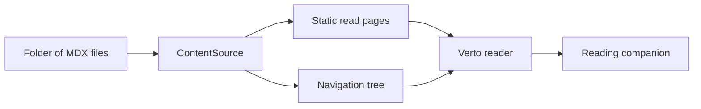

# Verto Feature Demo

Welcome. This document exists so you can **click around and try every feature** without hunting through the docs. Every block below is a real component — hover, click, expand, whatever it invites.

If you're just landing: Verto reads plain `.mdx` files from a folder and turns them into a navigable site. This file lives at `content/demo.mdx` and became the page you're reading.

## Callouts

Callouts frame a short idea. Three tones — `info`, `warning`, `tip`.

<Callout type="info" title="What to try">
  Everything below this line is interactive in some way. Click the toggles, hover the bookmark card, check off the task list.
</Callout>

<Callout type="warning">
  If a block below renders blank, that component is probably registered under a
  slightly different name in your build. Open the browser console — Verto's
  `UnknownComponent` fallback will tell you which tag it couldn't resolve.
</Callout>

<Callout type="tip" title="Author voice">
  A callout is a good place to say the loud thing quietly. Not a wall of text — one sentence, one point.
</Callout>

## Toggle — collapsible detail

Use `Toggle` when a section is optional context that not every reader needs to open.

<Toggle title="Click to expand: why does Verto render at build time?">
  Every page in Verto is pre-rendered at build time via Next.js static generation. That means the HTML you're reading was compiled from Markdown before your browser ever asked for it — zero runtime cost for parsing MDX, and syntax highlighting via Shiki ships as inline HTML with no client-side JavaScript.

  The tradeoff: content changes require a rebuild. For a reader-first product, that's the right tradeoff.
</Toggle>

<Toggle title="Click to expand: what does the folder-is-the-schema mean?">
  Verto has no database and no CMS. The file system is the source of truth:

  - Folders become sidebar sections
  - Filenames become URLs
  - Frontmatter is optional; missing fields fall back to first-H1 and file-mtime
  - `navigation.json` at the root exists only for **overrides** — reorder, rename, hide

  Move a file, and its URL moves. Rename a folder, and the section renames. No admin UI is possible because none is needed.
</Toggle>

## Task list

Task lists are real checkboxes. They persist visually — but Verto is a reader, not a task manager, so they don't sync anywhere.

<TaskList>
  - [x] Read a Verto document
  - [x] See a callout render correctly
  - [ ] Expand a Toggle above
  - [ ] Try clicking the inline comment popover below
  - [ ] Copy a code block using its button
  - [ ] Switch to dark mode via the theme toggle in the top bar
</TaskList>

## Inline comments — the signature feature

This is the block Verto exists to make possible. Inline comments use Markdown's footnote syntax with a `c-` prefix. Where a regular footnote sends you to the bottom of the page, an inline comment stays inline — a highlighted phrase with a small marker you can click to open a popover.

The distinction matters because the two are for different jobs. Regular footnotes are for citations[^1]. Inline comments are for the author's voice — the sidebar in a book, the note in the margin, the "here's what really happened" aside that would break the paragraph if you tried to write it inline[^c-1].

You can even mix them in a single sentence. Here's a claim I want to source[^2], and here's how I actually feel about it[^c-2].

## Bookmark card

Use `BookmarkCard` for a link that deserves visual weight — not every URL, just the ones you'd want a reader to click on.

<BookmarkCard
  href="https://opencode.ai"
  title="OpenCode"
  description="The AI coding agent Verto is built with. Open source, terminal-native, model-agnostic."
  domain="opencode.ai"
/>

<BookmarkCard
  href="https://nextjs.org"
  title="Next.js"
  description="The framework Verto runs on. App Router, React Server Components, and MDX support out of the box."
  domain="nextjs.org"
/>

## Figures — images with captions

`Figure` gives an image a caption and keeps the whole thing accessible.

<Figure src="/icon.png" alt="Verto app icon" caption="The Verto mark." />

## Mermaid diagrams

Mermaid fenced blocks render as diagrams, not highlighted code. Use them for flowcharts, sequence diagrams, and lightweight architecture notes that should stay readable in plain Markdown.



## Excalidraw sketches

Excalidraw fenced blocks turn a saved scene JSON into an inline sketch. They are useful when an idea wants spatial layout instead of a formal diagram.

```excalidraw
{
  "type": "excalidraw",
  "version": 2,
  "source": "https://verto.tsaiggo.com",
  "elements": [
    {
      "id": "article",
      "type": "rectangle",
      "x": 40,
      "y": 40,
      "width": 260,
      "height": 180,
      "angle": 0,
      "strokeColor": "#111827",
      "backgroundColor": "#f8fafc",
      "fillStyle": "solid",
      "strokeWidth": 2,
      "strokeStyle": "solid",
      "roughness": 1,
      "opacity": 100,
      "groupIds": [],
      "frameId": null,
      "roundness": { "type": 3 },
      "seed": 101,
      "version": 1,
      "versionNonce": 101,
      "isDeleted": false,
      "boundElements": null,
      "updated": 1,
      "link": null,
      "locked": false
    },
    {
      "id": "toc",
      "type": "rectangle",
      "x": 330,
      "y": 40,
      "width": 120,
      "height": 180,
      "angle": 0,
      "strokeColor": "#64748b",
      "backgroundColor": "#ffffff",
      "fillStyle": "solid",
      "strokeWidth": 2,
      "strokeStyle": "dashed",
      "roughness": 1,
      "opacity": 100,
      "groupIds": [],
      "frameId": null,
      "roundness": { "type": 3 },
      "seed": 102,
      "version": 1,
      "versionNonce": 102,
      "isDeleted": false,
      "boundElements": null,
      "updated": 1,
      "link": null,
      "locked": false
    },
    {
      "id": "agent",
      "type": "rectangle",
      "x": 480,
      "y": 40,
      "width": 180,
      "height": 180,
      "angle": 0,
      "strokeColor": "#2563eb",
      "backgroundColor": "#eff6ff",
      "fillStyle": "solid",
      "strokeWidth": 2,
      "strokeStyle": "solid",
      "roughness": 1,
      "opacity": 100,
      "groupIds": [],
      "frameId": null,
      "roundness": { "type": 3 },
      "seed": 103,
      "version": 1,
      "versionNonce": 103,
      "isDeleted": false,
      "boundElements": null,
      "updated": 1,
      "link": null,
      "locked": false
    },
    {
      "id": "article-to-toc",
      "type": "arrow",
      "x": 306,
      "y": 130,
      "width": 34,
      "height": 0,
      "angle": 0,
      "strokeColor": "#64748b",
      "backgroundColor": "transparent",
      "fillStyle": "solid",
      "strokeWidth": 2,
      "strokeStyle": "solid",
      "roughness": 1,
      "opacity": 100,
      "groupIds": [],
      "frameId": null,
      "seed": 104,
      "version": 1,
      "versionNonce": 104,
      "isDeleted": false,
      "boundElements": [],
      "updated": 1,
      "link": null,
      "locked": false,
      "startBinding": null,
      "endBinding": null,
      "lastCommittedPoint": null,
      "startArrowhead": null,
      "endArrowhead": "arrow",
      "points": [[0, 0], [34, 0]]
    },
    {
      "id": "toc-to-agent",
      "type": "arrow",
      "x": 456,
      "y": 130,
      "width": 34,
      "height": 0,
      "angle": 0,
      "strokeColor": "#2563eb",
      "backgroundColor": "transparent",
      "fillStyle": "solid",
      "strokeWidth": 2,
      "strokeStyle": "solid",
      "roughness": 1,
      "opacity": 100,
      "groupIds": [],
      "frameId": null,
      "seed": 105,
      "version": 1,
      "versionNonce": 105,
      "isDeleted": false,
      "boundElements": [],
      "updated": 1,
      "link": null,
      "locked": false,
      "startBinding": null,
      "endBinding": null,
      "lastCommittedPoint": null,
      "startArrowhead": null,
      "endArrowhead": "arrow",
      "points": [[0, 0], [34, 0]]
    }
  ],
  "appState": {
    "viewBackgroundColor": "#ffffff"
  },
  "files": {}
}
```

## Comparison table

Standard Markdown tables render with Verto's styling — no special component required.

| Feature              | Markdown / Obsidian | Verto                                    |
| -------------------- | ------------------- | ---------------------------------------- |
| Source of truth      | Folder of `.md`     | Folder of `.mdx` / `.md`                 |
| Rich blocks          | Plugins             | First-class MDX components               |
| Reading UI           | App pane            | Statically-rendered site                 |
| Inline author voice  | ❌ (footnotes only) | ✅ Popover comments (`[^c-N]`)           |
| Runtime cost         | App required        | Static HTML, zero client JS for content  |
| Lock-in              | None                | None — files stay portable               |

## Blockquote

> "The best way to write is to let the medium do what it's good at, and stop apologizing for what it isn't."
>
> — anonymous, probably

Verto styles blockquotes with a subtle left border and looser leading — quiet, not decorative.

## Code with syntax highlighting

Code blocks use Shiki with a dual light/dark theme, rendered at **build time**. No client JavaScript, and copy-to-clipboard is wired in.

```typescript
// A tiny snapshot of Verto's tree builder
export async function listAllFiles(): Promise<ContentFileNode[]> {
  const source = pickSource();
  const rawFiles = await source.listFiles();
  const tree = await materialize(rawFiles);
  return flattenFileNodes(tree);
}
```

```python
# Shiki handles Python too
def relevance(query: str, doc: Doc) -> float:
    signal = sum(1 for term in query.split() if term in doc.body.lower())
    return signal / max(1, len(doc.body.split()))
```

```bash
# And plain shell
npm install
npm run dev
# then open http://localhost:3000
```

## Install snippet — tabs across package managers

`PackageInstall` handles the tab switcher between npm / pnpm / yarn / bun automatically.

<PackageInstall pkg="verto" />

## Steps — ordered walkthrough

<Steps>
  1. **Drop a file** into `content/`. Any `.mdx` or `.md` works.
  2. **Save it.** Verto picks it up on the next request in dev mode.
  3. **Open the URL** that mirrors the file path — `content/my-note.mdx` → `/read/my-note`.
  4. **That's it.** No config, no build step for reading.
</Steps>

## What actually broke today

<Callout type="tip" title="You are here to try things">
  Poke the sidebar. Switch dark mode. Click an inline comment. Copy a code block. If something looks off, that's a design signal — Verto is a reader, and the reader is the source of truth for whether the UI works.
</Callout>

---

## Footnotes and comments

[^1]: Regular footnote — for citations, references, formal attribution. Renders at the bottom of the page with a superscript number back-link.

[^2]: Another regular footnote to prove the numbering works. In practice, use these for URLs, paper citations, or version-specific claims.

[^c-1]: Inline comment — for author voice. This is the "note in the margin" — the aside that would otherwise force you to break a paragraph into three. Try clicking the highlighted phrase in the paragraph above to see how it appears as a popover instead of getting dumped at the page bottom.

[^c-2]: Another inline comment — Verto lets you nest personal voice into any sentence without disturbing the rhythm of the writing. That's the whole point of the `[^c-N]` prefix: it degrades to a regular footnote on GitHub, but on Verto it becomes something else entirely.
