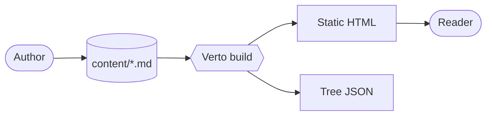
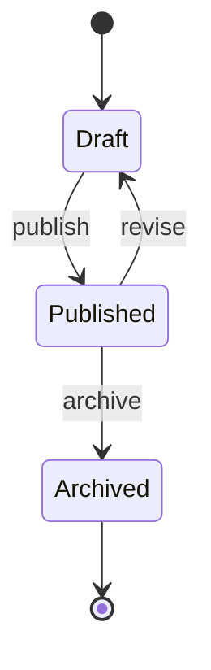

# Diagrams (Mermaid)

Verto supports [Mermaid](https://mermaid.js.org) diagrams in two equivalent forms.

## As a fenced code block

The familiar Markdown / Notion / GitHub form. A `rehype-mermaid` plugin intercepts these blocks before Shiki sees them and routes them to a client-side renderer.

## As an MDX component

For when you want to mix props, conditionals, or data binding into the source:

<Mermaid chart={`
sequenceDiagram
  participant R as Reader
  participant V as Verto
  participant FS as Filesystem
  R->>V: GET /read/docs/intro
  V->>FS: read intro.md
  FS-->>V: source
  V-->>R: rendered HTML
`} />

## State diagram

## Performance

The Mermaid bundle (~1 MB) is **dynamic-imported** — pages without diagrams pay zero bundle cost. The diagram re-renders automatically when the user toggles light / dark mode.

## Theming

Diagrams use a Verto-branded palette built on Mermaid's `base` theme: nodes pick up the site's accent blue, with mint and amber tints separating secondary and tertiary tiers (e.g. nested states, sequence actor labels). Notes use a soft yellow. Both light and dark modes are tuned to the same `--accent-blue` / `--text` tokens used elsewhere on the site, so diagrams sit naturally inside surrounding prose.
