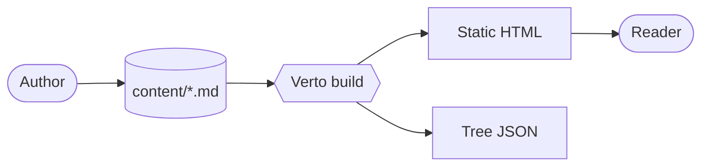
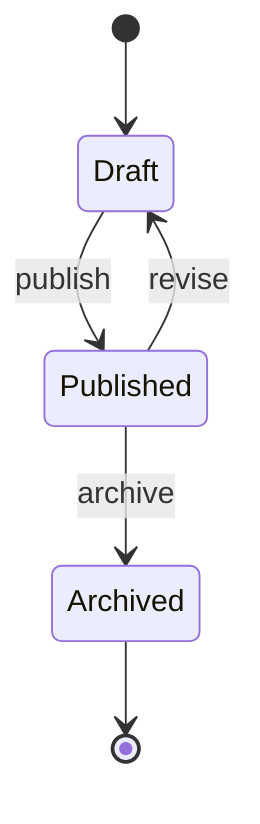

# Diagrams

Verto renders three diagram languages out of the box — **Mermaid** for
flowcharts and sequence / state diagrams, **Excalidraw** for hand-drawn
sketches, and **D2** for declarative diagrams. All three share the same
model, so once you've learned one you've learned them all.

| Renderer | Fence language | MDX component | Bundle | Best for |
|----------|----------------|---------------|--------|----------|
| [Mermaid](https://mermaid.js.org) | `mermaid` | `<Mermaid>` | ~1 MB | Flowcharts, sequence, state |
| [Excalidraw](https://excalidraw.com) | `excalidraw` | `<Excalidraw>` | dynamic | Hand-drawn sketches |
| [D2](https://d2lang.com) | `d2` | `<D2>` | ~3 MB (WASM) | Declarative diagrams |

## Two equivalent forms

Every renderer accepts your diagram in either of two forms:

- **As a fenced code block** — the familiar Markdown / Notion / GitHub form.
  A `rehype-*` plugin intercepts the block *before* Shiki sees it and routes
  it to a client-side renderer.
- **As an MDX component** — for when you want to mix props, conditionals, or
  data binding into the source.

Both produce identical output. Reach for the fence for portability (it
degrades to a labelled code block on GitHub), or the component when you're
generating the diagram programmatically.

<Callout type="tip">
Every diagram bundle is **dynamic-imported**, so pages without diagrams pay
zero bundle cost — and every renderer re-renders automatically when the
reader toggles light / dark mode.
</Callout>

## Mermaid

Verto supports [Mermaid](https://mermaid.js.org) diagrams in two equivalent forms.

### As a fenced code block

The familiar Markdown / Notion / GitHub form. A `rehype-mermaid` plugin
intercepts these blocks before Shiki sees them and routes them to a
client-side renderer.



### As an MDX component

For when you want to mix props, conditionals, or data binding into the source:

<Mermaid chart={`
sequenceDiagram
  participant R as Reader
  participant V as Verto
  participant FS as Filesystem
  R->>V: GET /read/docs/intro
  V->>FS: read intro.md
  FS-->>V: source
  V-->>R: rendered HTML
`} />

### State diagram



### Theming

Diagrams use a Verto-branded palette built on Mermaid's `base` theme: nodes
pick up the site's accent blue, with mint and amber tints separating secondary
and tertiary tiers (e.g. nested states, sequence actor labels). Notes use a
soft yellow. Both light and dark modes are tuned to the same `--accent-blue` /
`--text` tokens used elsewhere on the site, so diagrams sit naturally inside
surrounding prose.

## Excalidraw

Verto supports [Excalidraw](https://excalidraw.com) scenes in two equivalent forms.

### As a fenced code block

The familiar Markdown / Notion / GitHub form. A `rehype-excalidraw` plugin
intercepts these blocks before Shiki sees them and routes them to a
client-side renderer that exports the scene to an inline read-only SVG.

The body of the fence is the JSON exported from Excalidraw (File → Export
image → SVG, or "Save to…" → `.excalidraw`). Either the full `.excalidraw`
payload or a bare `{ "elements": [...], "appState": {...}, "files": {...} }`
triple works.

```excalidraw
{
  "type": "excalidraw",
  "version": 2,
  "source": "https://excalidraw.com",
  "elements": [
    {
      "id": "rect-1",
      "type": "rectangle",
      "x": 100,
      "y": 100,
      "width": 200,
      "height": 100,
      "angle": 0,
      "strokeColor": "#1e1e1e",
      "backgroundColor": "transparent",
      "fillStyle": "solid",
      "strokeWidth": 2,
      "strokeStyle": "solid",
      "roughness": 1,
      "opacity": 100,
      "groupIds": [],
      "frameId": null,
      "roundness": { "type": 3 },
      "seed": 1,
      "version": 1,
      "versionNonce": 0,
      "isDeleted": false,
      "boundElements": [],
      "updated": 0,
      "link": null,
      "locked": false
    }
  ],
  "appState": { "viewBackgroundColor": "#ffffff", "gridSize": null },
  "files": {}
}
```

### As an MDX component

For when you want to mix props or build the JSON dynamically:

<Excalidraw scene={`{
  "type": "excalidraw",
  "version": 2,
  "elements": [
    { "id": "e1", "type": "ellipse", "x": 0, "y": 0, "width": 160, "height": 160, "angle": 0, "strokeColor": "#1e1e1e", "backgroundColor": "transparent", "fillStyle": "solid", "strokeWidth": 2, "strokeStyle": "solid", "roughness": 1, "opacity": 100, "groupIds": [], "frameId": null, "roundness": { "type": 2 }, "seed": 1, "version": 1, "versionNonce": 0, "isDeleted": false, "boundElements": [], "updated": 0, "link": null, "locked": false }
  ],
  "appState": {},
  "files": {}
}`} />

### Preview

A richer scene — three nodes connected by arrows, in classic Excalidraw
hand-drawn style. The block below is rendered to an inline SVG at build / load
time; you are looking at the actual output, not a screenshot.

```excalidraw
{
  "type": "excalidraw",
  "version": 2,
  "source": "https://excalidraw.com",
  "elements": [
    {
      "id": "src",
      "type": "rectangle",
      "x": 40, "y": 80, "width": 160, "height": 70,
      "strokeColor": "#1971c2", "backgroundColor": "#a5d8ff",
      "fillStyle": "hachure", "strokeWidth": 2, "roughness": 1,
      "roundness": { "type": 3 }, "seed": 11
    },
    {
      "id": "src-label",
      "type": "text",
      "x": 70, "y": 102, "width": 100, "height": 25,
      "text": "Author", "fontSize": 20, "fontFamily": 1,
      "textAlign": "center", "verticalAlign": "middle",
      "strokeColor": "#1e1e1e", "seed": 12
    },
    {
      "id": "build",
      "type": "rectangle",
      "x": 280, "y": 80, "width": 160, "height": 70,
      "strokeColor": "#2f9e44", "backgroundColor": "#b2f2bb",
      "fillStyle": "hachure", "strokeWidth": 2, "roughness": 1,
      "roundness": { "type": 3 }, "seed": 21
    },
    {
      "id": "build-label",
      "type": "text",
      "x": 318, "y": 102, "width": 90, "height": 25,
      "text": "Verto build", "fontSize": 20, "fontFamily": 1,
      "textAlign": "center", "verticalAlign": "middle",
      "strokeColor": "#1e1e1e", "seed": 22
    },
    {
      "id": "out",
      "type": "rectangle",
      "x": 520, "y": 80, "width": 160, "height": 70,
      "strokeColor": "#e8590c", "backgroundColor": "#ffd8a8",
      "fillStyle": "hachure", "strokeWidth": 2, "roughness": 1,
      "roundness": { "type": 3 }, "seed": 31
    },
    {
      "id": "out-label",
      "type": "text",
      "x": 555, "y": 102, "width": 100, "height": 25,
      "text": "Reader", "fontSize": 20, "fontFamily": 1,
      "textAlign": "center", "verticalAlign": "middle",
      "strokeColor": "#1e1e1e", "seed": 32
    },
    {
      "id": "a1",
      "type": "arrow",
      "x": 200, "y": 115, "width": 80, "height": 0,
      "strokeColor": "#1e1e1e", "strokeWidth": 2, "roughness": 1,
      "points": [[0, 0], [80, 0]],
      "endArrowhead": "arrow", "seed": 41
    },
    {
      "id": "a2",
      "type": "arrow",
      "x": 440, "y": 115, "width": 80, "height": 0,
      "strokeColor": "#1e1e1e", "strokeWidth": 2, "roughness": 1,
      "points": [[0, 0], [80, 0]],
      "endArrowhead": "arrow", "seed": 42
    },
    {
      "id": "note",
      "type": "text",
      "x": 230, "y": 200, "width": 260, "height": 25,
      "text": "Markdown in, static HTML out",
      "fontSize": 16, "fontFamily": 1,
      "textAlign": "center", "verticalAlign": "middle",
      "strokeColor": "#868e96", "seed": 51
    }
  ],
  "appState": { "viewBackgroundColor": "#ffffff", "gridSize": null },
  "files": {}
}
```

### Theming

The renderer passes Excalidraw's own `theme: "light" | "dark"` plus
`exportWithDarkMode` flag based on the active site theme, so diagrams sit
naturally inside surrounding prose in both modes. The exported SVG omits the
scene background so it inherits the page surface.

## D2

Verto supports [D2](https://d2lang.com) diagrams in the same two equivalent
forms as Mermaid.

### As a fenced code block

```d2
direction: right
authors -> file: write
file -> verto: build
verto -> reader: serve
```

A `rehype-d2` plugin intercepts these blocks before Shiki sees them and
routes them to the client-side D2 renderer.

### As an MDX component

For when you want to mix props, conditionals, or data binding into the source:

<D2 chart={`
shape: sequence_diagram
reader -> verto: GET /read/docs/intro
verto -> fs: read intro.md
fs -> verto: source
verto -> reader: rendered HTML
`} />

### Safety

The rendered SVG is sanitized through DOMPurify before being injected into the
DOM, so even an attacker-crafted D2 source cannot smuggle script tags into the
page.

### Theming

Pass `themeId` and `darkThemeId` props to pick from D2's
[built-in themes](https://d2lang.com/tour/themes). Defaults are the neutral
light theme (id `0`) and D2's dark theme (id `200`). The diagram re-renders
automatically when the user toggles light / dark mode.

## Performance

All three renderers are loaded lazily so they never weigh down pages that
don't use them:

- **Mermaid** — the ~1 MB bundle is dynamic-imported on first use.
- **Excalidraw** — dynamic-imported, then each scene is exported to an inline
  read-only SVG at build / load time.
- **D2** — the ~3 MB WASM bundle is dynamic-imported, and its output is
  DOMPurify-sanitized before injection.

In every case, pages without that diagram type pay **zero** bundle cost, and
the diagram re-renders on light / dark toggle.

## Related

- [Block Components](/read/docs/writing/block-components) — including the
  `DiagramPlaceholder` for sketching out a diagram before you draw it
- [MDX Authoring](/read/docs/writing/mdx-authoring) for the full MDX writing guide
- [Syntax Highlighting](/read/docs/writing/syntax-highlighting) for how fenced
  code blocks are highlighted when they *aren't* diagrams
