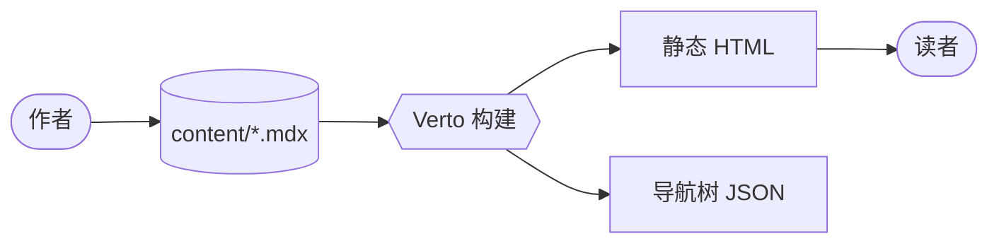
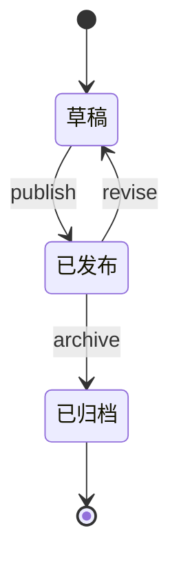

# Verto 全家桶演示

这篇文章是一份活的回归测试[^c-1]。`mdx-components.tsx` 里登记的每个组件、remark / rehype 管线里挂的每个插件、Shiki 支持的每种标注，下面都会至少出现一次。任何一个渲染器坏了，最先在这里露馅。

> 记录一个系统最好的方式，就是真的用它做点什么。

如果你正在线上站点阅读这篇文章，下面每一个块都是真实的渲染输出 —— 没有截图、没有伪造的样例。

---

## 1. 散文、GFM 与基础语法

Verto 默认启用 `remark-gfm`，所以表格、任务清单、删除线、自动链接都开箱即用。

你可以在同一段里混用 **粗体**、*斜体*、~~删除线~~ 和 `行内代码`，比如 `npm run dev`。裸 URL 会自动成链接：https://github.com/tsaiggo/verto。

> "博客引擎本质上是一套排版系统，顺便偶尔渲染一下代码。"
>
> 你写的每一段引用都会自动套上 `BlockquoteStyled` 样式，不需要写 JSX。

### 任务清单（GFM checkboxes）

- [x] 打开 `.mdx` 文件
- [x] 写 Markdown
- [x] 随手插入 JSX 组件
- [ ] 发现一个渲染器 bug
- [ ] 提一个 issue

### 表格（自动套用 `<Table>`）

| 特性               | 来源                    | 包体积代价 |
|--------------------|------------------------|------------|
| Shiki 高亮         | 构建期 rehype          | 0 KB       |
| KaTeX 数学公式     | 构建期 rehype          | 仅 CSS     |
| Mermaid 图         | 动态 `import()`        | 懒加载     |
| Excalidraw 图      | 动态 `import()`        | 懒加载     |
| 行内评论           | 自定义 remark + rehype | 极小 island |

---

## 2. Callout 提示框

三种风格 —— `info`（默认）、`warning`、`tip`。

<Callout>
  默认 callout，不写 `type` 时就是这个样子。
</Callout>

<Callout type="warning">
  写警告时记得给出替代方案 —— 既要指出陷阱，也要指明出路。
</Callout>

<Callout type="tip">
  `<Callout type="tip">` 适合搭配一段示例代码，用来强化推荐做法。
</Callout>

---

## 3. Toggle 折叠块

用 `<Toggle>` 收纳"想给但不挡路"的补充信息。

<Toggle title="Verto 是怎么发现这篇文章的？">
  `lib/content-source.ts` 会在构建期遍历 `content/` 目录，读取 frontmatter，再拼出导航树。带 `date` 字段的文件会进入博客列表，其余被当作文档。

  ```ts
  const CONTENT_DIR = path.join(process.cwd(), "content");
  ```
</Toggle>

<Toggle title="为什么是 MDX 而不是纯 Markdown？">
  MDX 允许我们在不离开 Markdown 的前提下，把 JSX 组件拌进散文里。remark / rehype 管线仍然处理所有 CommonMark 特性，JSX 完全是叠加上去的能力。
</Toggle>

---

## 4. Tabs 标签页

`id` 属性会把当前选中的 tab 同步到 URL hash，所以 `…#install=pnpm` 这种深链可以直接定位到指定页签。

<Tabs id="install">
  <Tab label="npm">
    ```bash
    npm install verto
    ```
  </Tab>
  <Tab label="pnpm">
    ```bash
    pnpm add verto
    ```
  </Tab>
  <Tab label="yarn">
    ```bash
    yarn add verto
    ```
  </Tab>
  <Tab label="bun">
    ```bash
    bun add verto
    ```
  </Tab>
</Tabs>

---

## 5. Steps 步骤

`<Steps>` 通过纯 CSS counter 给标题块自动编号 —— 零 JavaScript。

<Steps>
### 克隆仓库

```bash
git clone https://github.com/tsaiggo/verto.git
cd verto
```

### 安装依赖

```bash
npm install
```

### 把内容丢进 `content/`

任何 `.md` 或 `.mdx` 文件都会被自动发现，不需要单独注册。

### 启动开发服务器

```bash
npm run dev
```
</Steps>

---

## 6. Card 卡片

`<CardGroup cols={n}>` 用来横向排布多个 `<Card>`，带 `href` 的卡片可以点击跳转。

<CardGroup cols={2}>
  <Card title="快速开始" description="60 秒跑起一个 Verto" href="/help/getting-started/installation" />
  <Card title="行内评论" description="用 [^c-1] 在正文里加入弹窗式注解" href="/help/core-concepts/inline-comments" />
  <Card title="语法高亮" description="Shiki + 双主题 + diff / focus / word" href="/help/writing/syntax-highlighting" />
  <Card title="深色模式" description="基于 CSS 变量，切换零闪烁" href="/help/reading-experience/dark-mode" />
</CardGroup>

---

## 7. Accordion 手风琴

加上 `exclusive` 就是"同一时刻只能开一个"。

<AccordionGroup exclusive>
  <Accordion title="为什么用脚注语法做行内评论？">
    因为 `[^c-id]` 本身就是合法的 CommonMark。GitHub、Typora、任何不认识 Verto 的渲染器都会优雅降级成普通脚注 —— 你的注解永远不会丢。
  </Accordion>
  <Accordion title="Verto 需要数据库吗？">
    不需要。Verto 在构建期直接读文件系统，最终产物是完全静态的 HTML。
  </Accordion>
  <Accordion title="导航顺序可以自定义吗？">
    可以 —— 在 `content/navigation.json` 里用 slug 作为 key 配置 `overrides` 就行。
  </Accordion>
</AccordionGroup>

---

## 8. FileTree 文件树

<FileTree>
  <Folder name="content" defaultOpen>
    <Folder name="blog" defaultOpen>
      <File name="building-verto.mdx" />
      <File name="the-verto-kitchen-sink.mdx" comment="英文版" />
      <File name="verto-quan-jia-tong-yan-shi.mdx" comment="这一篇" />
    </Folder>
    <Folder name="docs">
      <File name="getting-started/installation.mdx" />
      <Folder name="features">
        <File name="syntax-highlighting.mdx" />
        <File name="diagrams.mdx" />
        <File name="excalidraw.mdx" />
        <File name="math.mdx" />
      </Folder>
    </Folder>
    <File name="navigation.json" comment="可选的顺序覆盖" />
  </Folder>
  <Folder name="components/mdx" defaultOpen={false}>
    <File name="Tabs.tsx" />
    <File name="Excalidraw.tsx" />
    <File name="Mermaid.tsx" />
  </Folder>
</FileTree>

---

## 9. 配图与书签卡

<Figure
  src="https://placehold.co/800x400/f3f4f6/111827?text=Verto+Pipeline"
  alt="Markdown 源文件流经 Verto 管线生成静态 HTML 的示意"
  caption="图 1 —— Markdown 进来，静态 HTML 出去。"
/>

<BookmarkCard
  url="https://github.com/tsaiggo/verto"
  title="tsaiggo/verto — GitHub"
  description="一款现代博客引擎 —— 写 Markdown，得到一份发表级的内容站。"
/>

<BookmarkCard
  url="https://nextjs.org"
  title="Next.js"
  description="Verto 的底层框架。"
/>

<DiagramPlaceholder
  title="将来要做：评论楼层"
  description="区别于行内作者注释的、按楼层组织的讨论。草图将在 v0.3 放出。"
/>

---

## 10. 数学公式（KaTeX）

行内公式可以塞在句子中间：欧拉恒等式 $e^{i\pi} + 1 = 0$，黄金比例 $\varphi = \frac{1 + \sqrt{5}}{2}$，调和级数发散速度为 $\sum_{n=1}^{N} \frac{1}{n} \sim \ln N$。

块级公式单独占行：

$$
\int_{-\infty}^{\infty} e^{-x^2} \, dx = \sqrt{\pi}
$$

多行对齐的证明用标准 `aligned` 环境：

$$
\begin{aligned}
(a + b)^2 &= a^2 + 2ab + b^2 \\
(a - b)^2 &= a^2 - 2ab + b^2 \\
a^2 - b^2 &= (a + b)(a - b)
\end{aligned}
$$

矩阵、求和、求积一应俱全：

$$
A = \begin{bmatrix}
1 & 2 & 3 \\
4 & 5 & 6 \\
7 & 8 & 9
\end{bmatrix}
\qquad
\sum_{n=1}^{\infty} \frac{1}{n^2} = \frac{\pi^2}{6}
$$

---

## 11. Mermaid 流程图

代码块形式：



组件形式（在需要拼接字符串时更顺手）：

<Mermaid chart={`
sequenceDiagram
  participant R as 读者
  participant V as Verto
  participant FS as 文件系统
  R->>V: GET /read/showcase/verto-quan-jia-tong-yan-shi
  V->>FS: 读取 .mdx
  FS-->>V: 源文件
  V-->>R: 渲染好的 HTML
`} />

再来一张状态图：



---

## 12. Excalidraw 手绘图

代码块形式 —— Shiki 来不及高亮之前就被 `rehype-excalidraw` 拦走了：

```excalidraw
{
  "type": "excalidraw",
  "version": 2,
  "source": "https://excalidraw.com",
  "elements": [
    {
      "id": "src",
      "type": "rectangle",
      "x": 40, "y": 80, "width": 160, "height": 70,
      "strokeColor": "#1971c2", "backgroundColor": "#a5d8ff",
      "fillStyle": "hachure", "strokeWidth": 2, "roughness": 1,
      "roundness": { "type": 3 }, "seed": 11
    },
    {
      "id": "src-label",
      "type": "text",
      "x": 70, "y": 102, "width": 100, "height": 25,
      "text": "Author", "fontSize": 20, "fontFamily": 1,
      "textAlign": "center", "verticalAlign": "middle",
      "strokeColor": "#1e1e1e", "seed": 12
    },
    {
      "id": "build",
      "type": "rectangle",
      "x": 280, "y": 80, "width": 160, "height": 70,
      "strokeColor": "#2f9e44", "backgroundColor": "#b2f2bb",
      "fillStyle": "hachure", "strokeWidth": 2, "roughness": 1,
      "roundness": { "type": 3 }, "seed": 21
    },
    {
      "id": "build-label",
      "type": "text",
      "x": 318, "y": 102, "width": 90, "height": 25,
      "text": "Verto build", "fontSize": 20, "fontFamily": 1,
      "textAlign": "center", "verticalAlign": "middle",
      "strokeColor": "#1e1e1e", "seed": 22
    },
    {
      "id": "out",
      "type": "rectangle",
      "x": 520, "y": 80, "width": 160, "height": 70,
      "strokeColor": "#e8590c", "backgroundColor": "#ffd8a8",
      "fillStyle": "hachure", "strokeWidth": 2, "roughness": 1,
      "roundness": { "type": 3 }, "seed": 31
    },
    {
      "id": "out-label",
      "type": "text",
      "x": 555, "y": 102, "width": 100, "height": 25,
      "text": "Reader", "fontSize": 20, "fontFamily": 1,
      "textAlign": "center", "verticalAlign": "middle",
      "strokeColor": "#1e1e1e", "seed": 32
    },
    {
      "id": "a1",
      "type": "arrow",
      "x": 200, "y": 115, "width": 80, "height": 0,
      "strokeColor": "#1e1e1e", "strokeWidth": 2, "roughness": 1,
      "points": [[0, 0], [80, 0]],
      "endArrowhead": "arrow", "seed": 41
    },
    {
      "id": "a2",
      "type": "arrow",
      "x": 440, "y": 115, "width": 80, "height": 0,
      "strokeColor": "#1e1e1e", "strokeWidth": 2, "roughness": 1,
      "points": [[0, 0], [80, 0]],
      "endArrowhead": "arrow", "seed": 42
    },
    {
      "id": "note",
      "type": "text",
      "x": 230, "y": 200, "width": 260, "height": 25,
      "text": "Markdown in, static HTML out",
      "fontSize": 16, "fontFamily": 1,
      "textAlign": "center", "verticalAlign": "middle",
      "strokeColor": "#868e96", "seed": 51
    }
  ],
  "appState": { "viewBackgroundColor": "#ffffff", "gridSize": null },
  "files": {}
}
```

组件形式 —— 适合动态拼装 JSON 的场景：

<Excalidraw scene={`{
  "type": "excalidraw",
  "version": 2,
  "elements": [
    { "id": "e1", "type": "ellipse", "x": 0, "y": 0, "width": 200, "height": 120, "angle": 0, "strokeColor": "#7048e8", "backgroundColor": "#d0bfff", "fillStyle": "hachure", "strokeWidth": 2, "strokeStyle": "solid", "roughness": 1, "opacity": 100, "groupIds": [], "frameId": null, "roundness": { "type": 2 }, "seed": 1, "version": 1, "versionNonce": 0, "isDeleted": false, "boundElements": [], "updated": 0, "link": null, "locked": false },
    { "id": "t1", "type": "text", "x": 50, "y": 48, "width": 100, "height": 25, "text": "<Excalidraw />", "fontSize": 18, "fontFamily": 3, "textAlign": "center", "verticalAlign": "middle", "strokeColor": "#1e1e1e", "seed": 2 }
  ],
  "appState": {},
  "files": {}
}`} />

---

## 13. 语法高亮（Shiki）

Verto 在构建期出双主题高亮。下面把（几乎）所有 Shiki 标注都过一遍。

### 普通代码块

```typescript
function greet(name: string): string {
  return `你好，${name}！`;
}
```

### 用注释标注高亮行

```ts
function greet(name: string) {
  const message = `你好，${name}`; // [!code highlight]
  return message;
}
```

### 用 meta 范围标注高亮行

```ts {2,4-5}
const a = 1;
const b = 2; // 被高亮
const c = 3;
const d = 4; // 被高亮
const e = 5; // 被高亮
```

### Diff（新增 / 删除）

```ts
function greet(name: string) {
  return `你好，${name}！`; // [!code --]
  return `嗨，${name}！`; // [!code ++]
}
```

```diff
- const old = "之前";
+ const next = "之后";
```

### Focus 聚焦模式

```ts
function focused() {
  const noise = 1;
  const important = 2; // [!code focus]
  const more = 3;
  return important; // [!code focus]
}
```

### 单词级高亮

```ts /verto/
const name = 'verto';
const slogan = 'verto：打开、阅读、评论。';
```

### 文件名 + 行号

```ts title="verto.config.ts" showLineNumbers
export default {
  theme: 'github-dark',
  features: ['mermaid', 'katex', 'excalidraw'],
};
```

### `noCopy` —— 只能看不能复制

```text noCopy
$ echo "只供观赏，请勿复制"
只供观赏，请勿复制
```

### 长代码自动折叠（超过约 30 行后出现"展开"按钮）

```tsx title="components/mdx/Excalidraw.tsx" showLineNumbers
'use client';

import {
  Children,
  useEffect,
  useMemo,
  useRef,
  useState,
  type ReactNode,
} from 'react';

interface ExcalidrawProps {
  scene?: string;
  children?: ReactNode;
}

type ExcalidrawModule = typeof import('@excalidraw/excalidraw');

let excalidrawPromise: Promise<ExcalidrawModule> | null = null;

function loadExcalidraw(): Promise<ExcalidrawModule> {
  if (!excalidrawPromise) {
    excalidrawPromise = import('@excalidraw/excalidraw');
  }
  return excalidrawPromise;
}

function isDarkTheme(): boolean {
  if (typeof document === 'undefined') return false;
  return document.documentElement.classList.contains('dark');
}

export default function Excalidraw({ scene, children }: ExcalidrawProps) {
  const source = useMemo(() => {
    if (typeof scene === 'string') return scene;
    return Children.toArray(children)
      .map((c) => (typeof c === 'string' ? c : ''))
      .join('')
      .trim();
  }, [scene, children]);

  const containerRef = useRef<HTMLDivElement>(null);
  const [error, setError] = useState<string | null>(null);
  const [dark, setDark] = useState<boolean>(false);
  const [ready, setReady] = useState<boolean>(false);

  useEffect(() => {
    const raf = requestAnimationFrame(() => setDark(isDarkTheme()));
    const observer = new MutationObserver(() => setDark(isDarkTheme()));
    observer.observe(document.documentElement, {
      attributes: true,
      attributeFilter: ['class'],
    });
    return () => {
      cancelAnimationFrame(raf);
      observer.disconnect();
    };
  }, []);

  // …此处省略大量构建/订阅逻辑
  return (
    <div className="excalidraw" role="img" aria-label="Diagram">
      {!ready && <span className="excalidraw-loading">Loading…</span>}
      <div ref={containerRef} className="excalidraw-host" />
    </div>
  );
}
```

---

## 14. 行内评论与脚注共存

Verto 的招牌特性：`[^c-N]` 渲染成点击弹窗，`[^N]` 渲染成页面底部的传统脚注，二者可以在同一段共存。

阅读流被打断的问题真实存在[^c-2] —— 大多数博客引擎逼你在"加一段考据"[^1] 和"写一句私货"[^c-3] 之间二选一。Verto 让你在同一段里把两件事一起做了[^2]。

---

## 收尾

如果上面所有内容都正常显示 —— Toggle 能展开、Tabs 能深链、数学公式排版整齐、Mermaid 图正常绘制、Excalidraw 手绘图按风格出现、代码块跟随深浅色模式瞬时切换、行内评论的弹窗能点开 —— 那么你的 Verto 部署是健康的。

把这一页加到书签里：它是日后任何渲染器改动最好的单页冒烟测试。

---

[^c-1]: 这篇文章故意写得"穷尽"。后续往 `mdx-components.tsx` 加新组件时，记得也来这里追加一段，让全家桶保持"全"。

[^c-2]: 在敲定脚注式触发之前，我试过悬浮侧栏、模态弹窗、黄色高亮，每一种都会把视线从段落里拽出去。

[^c-3]: 行内评论以 `[^c-N]` 形式存储，下游不认识 Verto 的 Markdown 渲染器照样会把它当成合法脚注 —— 注解永远不会丢。

[^1]: Dabit, Nader. *MDX: Markdown for the Component Era.* React Conf, 2019.

[^2]: 解析器靠前缀区分 `[^c-N]`（弹窗）与 `[^N]`（脚注），然后分别交给两个独立的 rehype 转换器处理。
